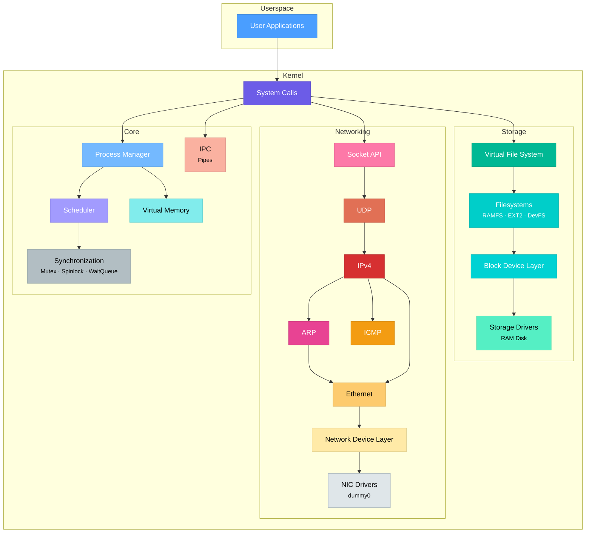
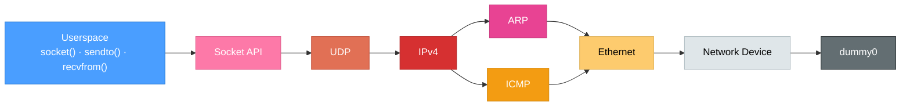

<p align="center">
  <h1 align="center">Atlas</h1>
  <p align="center">
    <strong>Experimental 32-bit operating system kernel built from the ground up.</strong>
  </p>
  <p align="center">
    <a href="#architecture">Architecture</a> · <a href="#current-status">Status</a> · <a href="#milestones">Milestones</a> · <a href="#building">Building</a>
  </p>
</p>

---

Atlas is a systems research kernel that focuses on understanding and engineering the core layers of an operating system — from process isolation and virtual memory to filesystems, device abstractions, inter-process communication, and networking.

Every subsystem is built incrementally: each phase introduces a clear architectural boundary, implements it, and verifies it through QEMU-based tests before moving upward.

> [!NOTE]
> Atlas is an experimental project. It is not intended to provide the reliability, hardware support, or completeness of production operating systems. Its purpose is experimentation, architecture exploration, and learning through implementation.

---

## Architecture

Atlas is built as a set of independent layers with explicit boundaries between subsystems. Higher layers never depend on the implementation details of lower layers.



**Design principles:**

| Principle | Example |
|---|---|
| **Layer isolation** | EXT2 talks to storage through the block-device abstraction, never to the RAM disk directly |
| **Protocol independence** | IPv4 resolves destinations through ARP, never manipulating Ethernet frames directly |
| **Ownership clarity** | Sockets consume UDP datagrams without knowing how packets physically arrived |
| **Hardware abstraction** | Ethernet does not depend on a particular NIC implementation |

---

## Current Status

### Kernel Core

| Feature | Status |
|---|:---:|
| 32-bit x86 protected mode | Done |
| GDT / TSS / IDT | Done |
| Physical memory manager | Done |
| Virtual memory manager | Done |
| Per-process address spaces | Done |
| Ring 3 userspace execution | Done |
| Process and thread separation | Done |
| Preemptive scheduler | Done |
| Kernel threads | Done |
| Synchronization (mutex, spinlock, wait queue) | Done |
| System call infrastructure | Done |
| Safe userspace memory access (`copy_from_user` / `copy_to_user`) | Done |
| Pipes (IPC) | Done |

### Virtual File System & Storage

| Feature | Status |
|---|:---:|
| VFS abstraction layer | Done |
| File descriptors (`open`, `read`, `write`, `close`, `lseek`) | Done |
| `dup` / `dup2` | Done |
| Mount / unmount | Done |
| RAMFS | Done |
| Device filesystem | Done |
| Generic block-device layer | Done |
| Byte-to-block translation | Done |
| RAM disk driver | Done |

### EXT2 Filesystem

Atlas includes an incrementally developed, writable EXT2 implementation:

| Feature | Status |
|---|:---:|
| Superblock and geometry validation | Done |
| Directory traversal and lookup | Done |
| Regular file reads (direct + singly-indirect blocks) | Done |
| Block and inode allocation | Done |
| Regular file writes and growth | Done |
| File creation (`O_CREAT`) | Done |
| Directory creation (`mkdir`) with `.` and `..` entries | Done |
| Persistent mutation across unmount/remount | Done |
| Deletion (`unlink`, `rmdir`) | Planned |
| Rename | Planned |
| Doubly/triply-indirect blocks | Planned |

### Networking



| Feature | Status |
|---|:---:|
| Packet buffer abstraction (push/pull) | Done |
| Network device abstraction | Done |
| Dummy NIC (deterministic testing) | Done |
| Ethernet framing, parsing, MAC filtering | Done |
| ARP requests, replies, and cache | Done |
| IPv4 framing, validation, and checksum | Done |
| IPv4 protocol demultiplexing | Done |
| ICMP Echo Request / Reply | Done |
| UDP with pseudo-header checksum | Done |
| UDP port dispatch | Done |
| Socket abstraction with receive queues | Done |
| Blocking `recvfrom` with wait queues | Done |
| Socket / file descriptor integration | Done |
| Userspace `socket()`, `bind()`, `sendto()`, `recvfrom()` | Done |
| Hardware NIC driver | Planned |
| TCP | Planned |

> [!NOTE]
> The networking stack currently uses a **dummy network device** (`dummy0`) for deterministic kernel-level testing. Hardware NIC drivers will be added in a future phase.

---

## Milestones

```mermaid
gantt
    title Atlas Development Phases
    dateFormat X
    axisFormat %s

    section Storage
    Block Device Layer           :done, 1, 2
    EXT2 Read-Only               :done, 2, 3
    EXT2 Metadata Allocation     :done, 3, 4
    EXT2 File Writes             :done, 4, 5
    EXT2 File Creation           :done, 5, 6
    EXT2 Directory Creation      :done, 6, 7

    section Networking
    Network Device Layer         :done, 7, 8
    Ethernet                     :done, 8, 9
    ARP                          :done, 9, 10
    IPv4                         :done, 10, 11
    ICMP                         :done, 11, 12
    UDP                          :done, 12, 13
    Socket API                   :done, 13, 14
```



| Phase | Subsystem | Description | Status |
|:---:|---|---|:---:|
| 15 | Storage | Generic block device layer | Done |
| 16 | Filesystem | EXT2 read-only filesystem | Done |
| 17A | Filesystem | EXT2 metadata allocation | Done |
| 17B | Filesystem | EXT2 regular file writes | Done |
| 17C | Filesystem | EXT2 file creation (`O_CREAT`) | Done |
| 17D | Filesystem | EXT2 directory creation (`mkdir`) | Done |
| 18A | Networking | Network device layer | Done |
| 18B | Networking | Ethernet framing | Done |
| 18C | Networking | ARP | Done |
| 18D | Networking | IPv4 | Done |
| 18E | Networking | ICMP | Done |
| 18F | Networking | UDP | Done |
| 18G | Networking | Socket API | Done |

---

## Building

### Prerequisites

- `gcc` (with 32-bit support)
- `nasm` or `as` (GNU assembler)
- `grub-mkrescue` and `xorriso`
- `qemu-system-i386`

### Build & Run

```bash
make clean && make
qemu-system-i386 -cdrom atlas.iso -serial stdio
```

### Run with Serial Log

```bash
qemu-system-i386 -cdrom atlas.iso -serial file:serial.log -display none \
    -no-reboot -device isa-debug-exit,iobase=0xf4,iosize=0x04
```

---

## Repository Structure

```text
atlas/
├── kernel/                     # Kernel source
│   ├── arch/x86/               # x86 architecture (GDT, IDT, PIC, context switch)
│   ├── drivers/                # Device drivers (console, serial, timer, ramdisk)
│   ├── fs/                     # Filesystems (VFS, RAMFS, DevFS, EXT2, pipes, block)
│   ├── lib/                    # Kernel libraries (string, memory, printf, list)
│   ├── net/                    # Networking (ethernet, ARP, IPv4, ICMP, UDP, sockets)
│   ├── scheduler/              # Process, thread, and scheduler management
│   ├── sync/                   # Synchronization primitives (mutex, spinlock, waitqueue)
│   ├── kernel.c                # Kernel entry point
│   └── syscall.c               # System call dispatch
│
├── include/kernel/             # Kernel headers
│   ├── fs/                     # VFS, block device, EXT2 headers
│   ├── net/                    # Networking headers
│   ├── scheduler/              # Scheduler headers
│   └── sync/                   # Synchronization headers
│
├── runtime/
│   ├── libc/                   # Freestanding C library (stdio, stdlib, string, malloc, pthread)
│   ├── libatlas/               # Atlas system library (syscall wrappers, process, memory, sockets)
│   └── crt/                    # C runtime startup
│
├── tests/
│   ├── userspace_apps/         # Userspace test programs (source)
│   └── userspace/              # Userspace binary blobs and linker scripts
│
├── scripts/                    # Build and utility scripts
├── docs/                       # Architecture documents and design records
├── Makefile                    # Top-level build system
├── linker.ld                   # Kernel linker script
├── grub.cfg                    # GRUB bootloader configuration
└── .gitignore
```

---

## Testing

Atlas is tested by building the kernel and booting it under QEMU. Each milestone includes dedicated kernel-level and integration tests that verify behavior across subsystem boundaries.

<details>
<summary><strong>Test Coverage</strong></summary>

| Area | Tests |
|---|---|
| **Kernel** | Process isolation, context switching, kernel threads |
| **Syscalls** | `fork`, `exec`, `waitpid`, `exit`, `getpid`, `kill` |
| **Memory** | Virtual memory mapping, `mmap`, `brk`, page fault handling |
| **IPC** | Pipe read/write, pipe synchronization |
| **VFS** | File descriptor operations, `dup`/`dup2` |
| **EXT2** | Read, write, create, `mkdir`, persistence across remount |
| **Block Device** | Byte-granularity I/O, unaligned access, read-modify-write |
| **Networking** | Packet buffer ops, Ethernet parsing, ARP resolution, IPv4 validation |
| **Transport** | ICMP echo, UDP checksum, UDP port dispatch |
| **Sockets** | Socket creation, bind, blocking `recvfrom`, queue limits, `sendto`, close |
| **Userspace** | Full end-to-end userspace networking via `socktest` |
| **Threading** | `pthread_create`, mutex, TLS |

</details>

---

## Development Philosophy

Atlas is developed with the following principles:

- **Incremental design** — each phase introduces one clear boundary
- **Layer isolation** — subsystems communicate only through defined interfaces
- **Explicit ownership** — buffers, descriptors, and allocations have clear lifetimes
- **Defensive validation** — inputs are validated at every boundary crossing
- **Hardware independence** — abstractions separate policy from mechanism
- **Test-driven milestones** — every phase is verified before moving upward

---

## Roadmap

Near-term development areas include:

- TCP state machine and connection management
- Hardware NIC driver (e.g., Intel e1000)
- Filesystem operations (`unlink`, `rename`)
- Doubly/triply-indirect EXT2 blocks
- Loopback interface
- Routing table

The long-term direction is to evolve Atlas into a progressively more complete experimental OS with independently developed kernel components and a usable userspace.

---

<p align="center">
  <sub>Atlas is an experimental systems research project.</sub>
</p>
